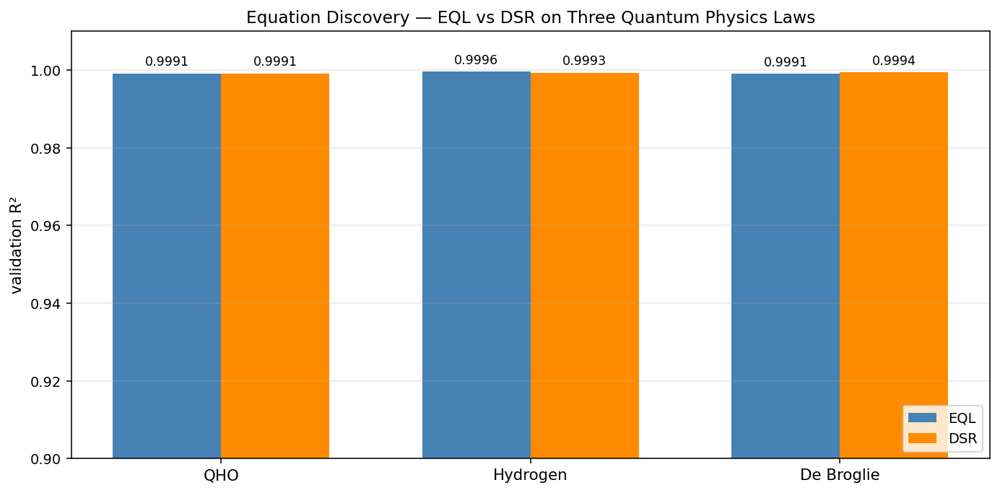
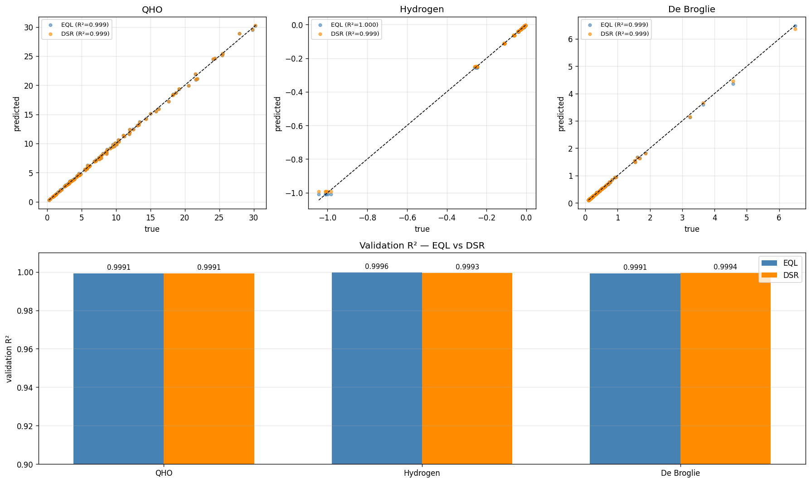

# Equation Discovery for Quantum Physics

A from-scratch comparison of two symbolic-regression methods — **Equation Learner Networks (EQL)** and **Deep Symbolic Regression (DSR)** — applied to rediscovering quantum physics laws from noisy synthetic data. Both methods are implemented in TensorFlow / Keras on a CPU laptop.



## TL;DR

Both methods achieve val R² > 0.999 on all three problems — neither is the bottleneck on accuracy. The methods diverge sharply on **symbolic fidelity**:

- **DSR returns directly interpretable formulas** that match the textbook physics with small numerical drift.
- **EQL returns numerically-equivalent but symbolically distributed approximations** whose structure is partially obscured by L1 shrinkage and threshold-based extraction.

This contrast — continuous relaxation versus discrete search — is the methodological point of the project.

## Motivation

Symbolic regression sits at the intersection of machine learning and scientific discovery: given data sampled from an unknown physical law, can a model output the underlying *equation*, not just a black-box fit? Two paradigms dominate the literature:

- **EQL** (Sahoo et al., 2018): a neural network whose hidden units are symbolic primitives (`sin`, `exp`, multiplication, inversion); trained by gradient descent with an L1 sparsity penalty. The discovered formula is read off the surviving weights.
- **DSR** (Petersen et al., 2021): an LSTM policy that samples discrete expression trees; trained by risk-seeking policy gradient on a reward proportional to fit quality.

This project implements both from scratch, applies them to three textbook quantum physics laws, and quantifies where each succeeds and where each fails.

## Problems

| Problem | True Formula | Setup |
|---|---|---|
| Quantum Harmonic Oscillator | E = ω(n + 1/2) | n ∈ [0, 10] integer; ω ∈ [0.5, 3.0] |
| Hydrogen Energy Levels      | E = −1/n²     | n ∈ [1, 15] integer (Rydberg units) |
| De Broglie Relation         | λ = 1/p       | p ∈ [0.1, 10.0] (natural units, h = 1) |

500 samples per problem, 2 % relative Gaussian noise, 80/20 train/val split, identical splits used across both methods for an honest comparison.

## Methods

**EQL** is implemented as a custom Keras layer wrapping five symbolic primitives (identity, sin, exp, inverse, multiplication). Two such layers are stacked, followed by a linear projection. Training uses a Huber data loss plus an L1 penalty on the projection weights to drive sparsity, with gradient clipping and early stopping on validation loss. The trained network is post-processed by a symbolic extractor that thresholds small weights and converts the surviving structure into a SymPy expression.

**DSR** is implemented with a small LSTM policy (32-unit hidden state) emitting a distribution over a per-problem vocabulary at each timestep. Token sequences are sampled into expression trees with arity-aware masking to guarantee syntactic validity; placeholder constants are optimized via multi-start BFGS; reward is `1 / (1 + NRMSE)`. The policy is updated by risk-seeking policy gradient — only the top 5 % of sampled expressions contribute to the gradient — with an entropy bonus to maintain exploration.

## Results

### Comparison: discovered formulas

| Problem | True | EQL discovered | DSR discovered |
|---|---|---|---|
| QHO        | `ω(n + 1/2)` | `0.895·n·ω + 0.857` (constant absorbs the ω/2 term) | `ω·(n + 0.535 − 0.017·ω)` |
| Hydrogen   | `−1/n²`      | distributed across `sin + inverse` primitives; structure not recovered at threshold ≥ 0.10 | `−0.989/n² − 0.005/n + 0.0003` |
| De Broglie | `1/p`        | `0.3 · exp(1/p) · exp(−2 sin(p/6 + 2/5 − 19/(14p))/9)` | `(8.5e-5·p + 1.003) / (p + 0.003)` ≈ `1/p` |

### Comparison: validation R²

| Problem | EQL val R² | DSR val R² |
|---|---|---|
| QHO        | 0.99914 | 0.99914 |
| Hydrogen   | 0.99960 | 0.99935 |
| De Broglie | 0.99910 | 0.99939 |

Predictions vs true values, both methods overlaid:



Full machine-readable results in `results/final_results.json` and `results/comparison.csv`.

## Key Findings

**Numerical fit is comparable.** Across all three problems, both methods land in the 0.999–1.000 range. Any difference at this precision is dominated by the noise floor of the training data, not by methodological superiority. Accuracy is *not* what separates these methods.

**Symbolic fidelity is not.** DSR returned formulas that any physicist could read off the page: `−1/n²`, `1/p`, `ω(n + 0.5)`, each with small numerical drift on the constants. EQL returned numerically-equivalent fits, but the underlying primitive combinations are distributed across the network in a way that resists clean extraction. The hydrogen case is the starkest: EQL's R² is the highest of any cell in the table (0.99960), yet its extracted form at threshold ≥ 0.10 returns `nan` because the recovered structure is so distributed that thresholding kills it; at lower thresholds it produces a noisy combination of inverse and sine terms that approximate `−1/n²` numerically but not symbolically. DSR's hydrogen formula, by contrast, is essentially correct: `−0.989/n²` with a coefficient within 1 % of −1.

**The methodological contrast is real.** EQL's continuous relaxation makes it gradient-friendly and fast to train; the cost is paid at extraction time, where L1 shrinkage and thresholding lose interpretability. DSR's discrete search has no such loss — sampled trees *are* the formula — but pays for it in compute (an order of magnitude longer training per problem on CPU) and in sensitivity to vocabulary design.

## Honest Limitations

- **DSR's QHO and De Broglie formulas contain small extraneous terms** (`−0.017·ω` in QHO, `8.5e-5·p` in de Broglie). These are numerical artifacts of BFGS landing on local optima with non-zero coefficients on near-irrelevant tokens. Longer training or coefficient pruning would likely remove them.
- **EQL's primitive set does not include `log`.** The de Broglie relation `λ = 1/p` is one inverse operation away from `log(λ) = −log(p)`, but `log` is not in the EQL vocabulary. The model's only routes to fit the data are the convoluted exp/sin/inv combinations seen above. Adding `log` would enlarge the search space and is a documented avenue for follow-up.
- **Single noise level (2 %).** A noise-robustness sweep across multiple SNRs would strengthen the comparison and is the natural next experiment.
- **Single seed per training run.** Multi-seed runs would give statistical confidence on the R² differences (which are currently within noise of each other).

## Repository Structure
quantum-eql-physics/

├── notebook/equation_discovery.ipynb   # full implementation, 25 cells

├── data/                               # generated CSV datasets

├── figures/                            # all plots

├── results/                            # CSV + JSON results

├── requirements.txt

└── README.md
## Reproducing

```bash
git clone https://github.com/Omdeshmukh-17/quantum-eql-physics.git
cd quantum-eql-physics
python -m venv .venv
source .venv/bin/activate          # Windows: .venv\Scripts\activate
pip install -r requirements.txt
python -m ipykernel install --user --name=eqdiscovery
jupyter notebook notebook/equation_discovery.ipynb
```

Select the `Python (eqdiscovery)` kernel and run all cells in order. Total runtime on a CPU laptop (Intel i7) is roughly 1.5–2 hours, dominated by the three DSR training runs at ~25 minutes each.

## References

- Sahoo, S., Lampert, C., & Martius, G. (2018). *Learning Equations for Extrapolation and Control.* ICML.
- Petersen, B. K., Landajuela, M., Mundhenk, T. N., Santiago, C. P., Kim, S. K., & Kim, J. T. (2021). *Deep Symbolic Regression: Recovering Mathematical Expressions from Data via Risk-Seeking Policy Gradients.* ICLR.

## Author

Om Deshmukh — B.Tech CSE, Pandit Deendayal Energy University. This project is part of a portfolio targeting MSc admissions in Machine Learning / AI for Science programs.