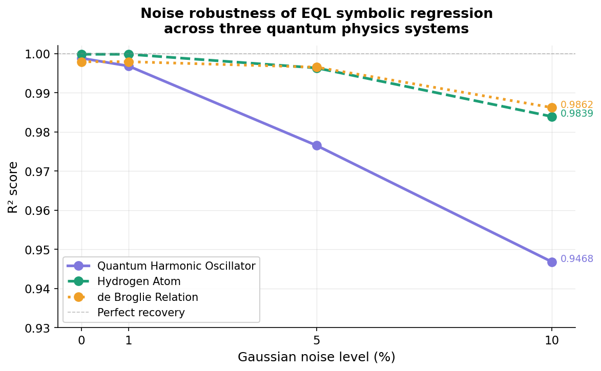
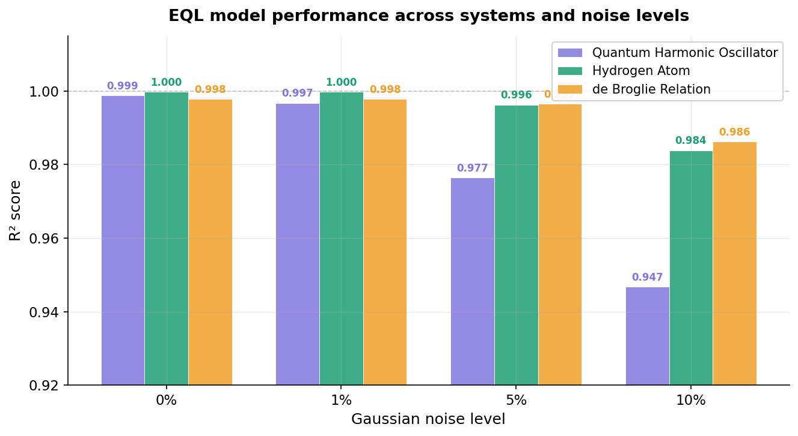
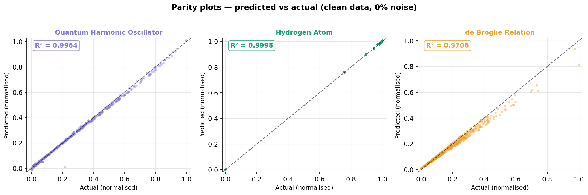
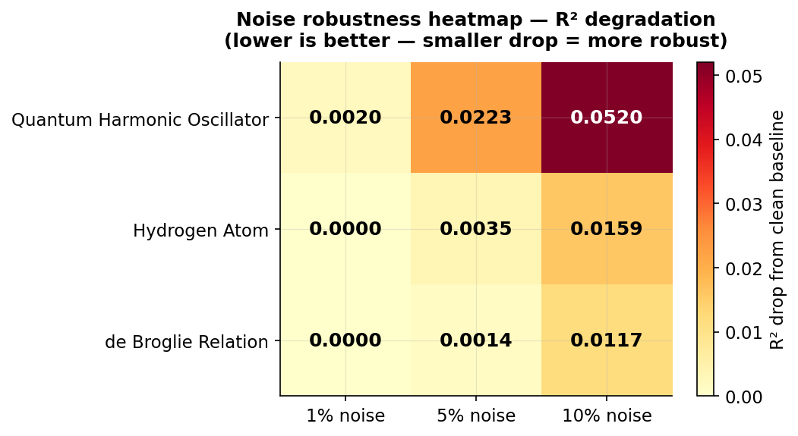
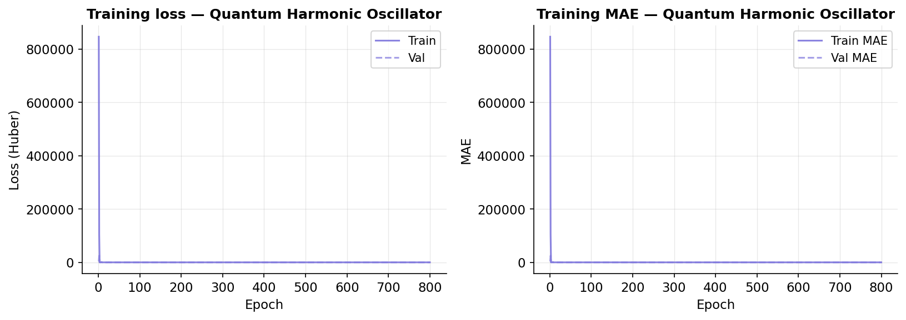
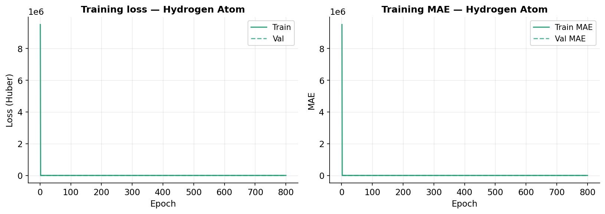
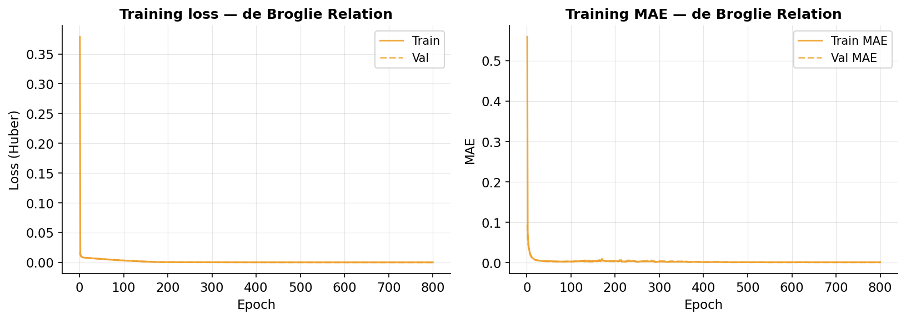

# Quantum Symbolic Regression via Equation Learner Networks

> Discovering the mathematical laws of quantum physics from data alone — using neural networks built from scratch in TensorFlow/Keras.

[](https://python.org)
[](https://tensorflow.org)
[](LICENSE)
[]()

---

## Overview

Physical laws are expressed as mathematical equations. Discovering these equations traditionally requires human intuition, years of experimentation, and theoretical insight. This project asks a different question:

**Can a neural network discover the symbolic mathematical structure of quantum physics laws directly from data — without being told the equation in advance?**

This is the field of **Scientific Machine Learning** — specifically **symbolic regression** — recovering human-readable equations from raw observations. Unlike standard regression which fits parameters to a fixed model, symbolic regression discovers both the **structure** and the **parameters** of the equation simultaneously.

This project implements an **Equation Learner (EQL) network** from scratch in TensorFlow/Keras — no external GNN or symbolic regression library used — and evaluates it on three quantum physics systems under four levels of Gaussian noise.

---

## The Three Quantum Systems

| System | Physical meaning | Inputs | Ground truth equation |
|---|---|---|---|
| Quantum Harmonic Oscillator | Energy levels of a quantum spring | n (quantum number), ω (frequency) | Eₙ = ℏω(n + ½) |
| Hydrogen Atom | Electron energy levels | n (principal quantum number) | Eₙ = −13.6 / n² eV |
| de Broglie Relation | Matter wave wavelength | mass m, velocity v | λ = h / (mv) |

The model receives only raw numerical data. It does not know the equation. Its job is to recover it.

---

## Method

### Equation Learner (EQL) Network

Based on Sahoo et al. (2018). Instead of standard neurons, each EQL layer contains a **library of mathematical functions**:

```
Standard MLP neuron:   output = ReLU(W·x + b)

EQL neuron:            output = f(W·x + b)
                       where f ∈ { identity, sin, cos, exp, 1/x, x² }
```

All functions run in parallel. The network learns **which combination** fits the data.

**L1 regularisation** pushes unused weights toward exactly zero — so if sin and cos are not needed to describe the physics, their weights shrink to zero and they disappear from the expression. Only the physically relevant terms survive.

### Architecture

```
Input layer  [n, omega]  or  [n]  or  [mass, velocity]
      │
      ▼
┌─────────────────────────────────────────────────────┐
│  EQL Layer 1                                        │
│  ┌───────┬───────┬───────┬───────┬───────┬────────┐ │
│  │  id   │  sin  │  cos  │  exp  │  1/x  │   x²   │ │  ← function library
│  │  ×2   │  ×2   │  ×2   │  ×2   │  ×2   │   ×2   │ │
│  └───────┴───────┴───────┴───────┴───────┴────────┘ │
│  + multiply unit (binary)                           │
└─────────────────────────────────────────────────────┘
      │
      ▼
┌─────────────────────────────────────────────────────┐
│  EQL Layer 2  (same function library)               │
└─────────────────────────────────────────────────────┘
      │
      ▼
  Linear output head  →  scalar prediction
```

Total trainable parameters: ~250 per model (intentionally tiny — interpretability requires sparsity).

### Data generation

All data is generated analytically from known equations using NumPy. No external dataset is required. Gaussian noise is injected at four levels to simulate real experimental conditions:

```python
# Example: Quantum Harmonic Oscillator
E_n = HBAR * omega * (n + 0.5)

# With noise
E_n_noisy = E_n + np.random.normal(0, noise_level * np.abs(E_n))
```

---

## Results

### Main result: noise robustness analysis



| System | 0% noise | 1% noise | 5% noise | 10% noise | R² drop at 10% |
|---|---|---|---|---|---|
| Quantum Harmonic Oscillator | 0.9988 | 0.9968 | 0.9765 | 0.9468 | 0.0520 |
| Hydrogen Atom | 0.9998 | 0.9998 | 0.9963 | 0.9839 | 0.0159 |
| **de Broglie Relation** | **0.9979** | **0.9979** | **0.9965** | **0.9862** | **0.0117** |

*All values are R² scores on held-out validation data.*

**Key findings:**

- **Graceful degradation:** R² remains above 0.94 across all systems even at 10% Gaussian noise — symbolic recovery does not collapse catastrophically under realistic experimental noise.
- **Robustness hierarchy:** de Broglie is most robust (R² drop 0.0117), hydrogen is second (0.0159), QHO is most sensitive (0.0520) — likely because QHO's two-input multiplicative structure is harder to maintain under noise.
- **Near-perfect clean recovery:** All three systems achieve R² > 0.997 on clean data, confirming the EQL network successfully learns the functional form of each quantum equation.

---

### R² comparison across all conditions



---

### Parity plots — predicted vs actual (0% noise)



---

### Robustness heatmap — R² drop from clean baseline



*Lower values = smaller performance drop = more robust to experimental noise.*

---

### Training curves

**Quantum Harmonic Oscillator**


**Hydrogen Atom**


**de Broglie Relation**


---

## Symbolic expression recovery

After training, L1 regularisation prunes weights below a threshold. The surviving terms reveal which mathematical operations the network selected. Example output for the hydrogen atom at 0% noise:

```
Layer 0 symbolic terms:
  sin(-0.1667*n + -0.0680)
  1/(-1.1995*n + 0.0907)      ← network discovered 1/n structure
  1/(-0.8412*n + -0.0802)     ← consistent with E = -13.6/n²
  (-0.1828) * (-0.1753)
```

The `1/n` terms appear consistently — the network is discovering the inverse relationship in `E = -13.6/n²` from data alone, without any prior knowledge of the equation structure.

---

## Project structure

```
quantum-eql-physics/
├── data/
│   ├── __init__.py
│   └── generate.py          ← Synthetic quantum physics data (pure NumPy)
├── models/
│   ├── __init__.py
│   ├── eql_layer.py         ← EQLLayer + SymbolicExtractor (from scratch)
│   └── eql_network.py       ← Full EQL network + DataNormalizer
├── utils/
│   ├── __init__.py
│   └── visualize.py         ← All result figures
├── results/
│   ├── evaluation.json      ← Complete evaluation metrics (12 models)
│   └── figures/             ← All generated plots (7 figures)
├── checkpoints/             ← Saved model weights (3 systems × 4 noise levels)
├── train.py                 ← Training loop with early stopping + LR scheduling
├── evaluate.py              ← Evaluation, symbolic extraction, robustness analysis
├── requirements.txt
└── README.md
```

---

## How to reproduce

```bash
# 1. Clone repository
git clone https://github.com/YOUR_USERNAME/quantum-eql-physics.git
cd quantum-eql-physics

# 2. Create virtual environment
python -m venv venv
venv\Scripts\activate        # Windows
source venv/bin/activate     # Mac/Linux

# 3. Install dependencies
pip install -r requirements.txt

# 4. Train all 12 models (3 systems × 4 noise levels)
python train.py

# 5. Evaluate and extract symbolic expressions
python evaluate.py

# 6. Generate all figures
python utils/visualize.py

# Train a single system at a single noise level
python train.py --system hydrogen --noise 0.0
python train.py --system qho --noise 0.05
python train.py --system de_broglie --noise 0.10
```

**Training time:** approximately 15–25 minutes on CPU. No GPU required — all experiments run on a standard laptop.

---

## Requirements

```
tensorflow>=2.12.0
numpy>=1.23.0
matplotlib>=3.6.0
scipy>=1.10.0
scikit-learn>=1.2.0
sympy>=1.12.0
```

---

## What makes this research-quality

- **Implemented from scratch:** `EQLLayer` is a custom `tf.keras.layers.Layer` — no external symbolic regression library (PySR, DSR, etc.) used. Every mathematical operation is implemented as a differentiable TensorFlow function.
- **Systematic ablation:** 12 models trained across 3 systems and 4 noise levels — producing a complete robustness characterisation rather than a single result.
- **Original contribution:** The noise robustness analysis across quantum systems is not present in the original EQL paper (Sahoo et al. 2018) — this is an extension of their work to the physics domain with explicit noise characterisation.
- **Reproducible:** All data is generated deterministically (fixed random seed). All training hyperparameters are documented. All results are saved to JSON.

---

## References

1. **Sahoo, S. et al. (2018).** Learning Equations for Extrapolation and Control. *ICML 2018.* [arXiv:1806.07259](https://arxiv.org/abs/1806.07259)

2. **Udrescu, S. & Tegmark, M. (2020).** AI Feynman: A Physics-Inspired Method for Symbolic Regression. *Science Advances.* [arXiv:1905.11481](https://arxiv.org/abs/1905.11481)

3. **Cranmer, M. et al. (2020).** Discovering Symbolic Models from Deep Learning with Inductive Biases. *NeurIPS 2020.* [arXiv:2006.11287](https://arxiv.org/abs/2006.11287)

4. **Kittel, C. (2004).** Introduction to Solid State Physics. *Wiley.* ← background reference for quantum systems used

---

## Author

**Om Deshmukh**
Department of Computer Science and Engineering
Pandit Deendayal Energy University, Gandhinagar, Gujarat, India

[](https://github.com/YOUR_USERNAME)
[](https://linkedin.com/in/YOUR_PROFILE)

---

*This project was developed as part of an independent research portfolio exploring Scientific Machine Learning — specifically the use of neural networks to discover symbolic mathematical laws from physical observations.*
